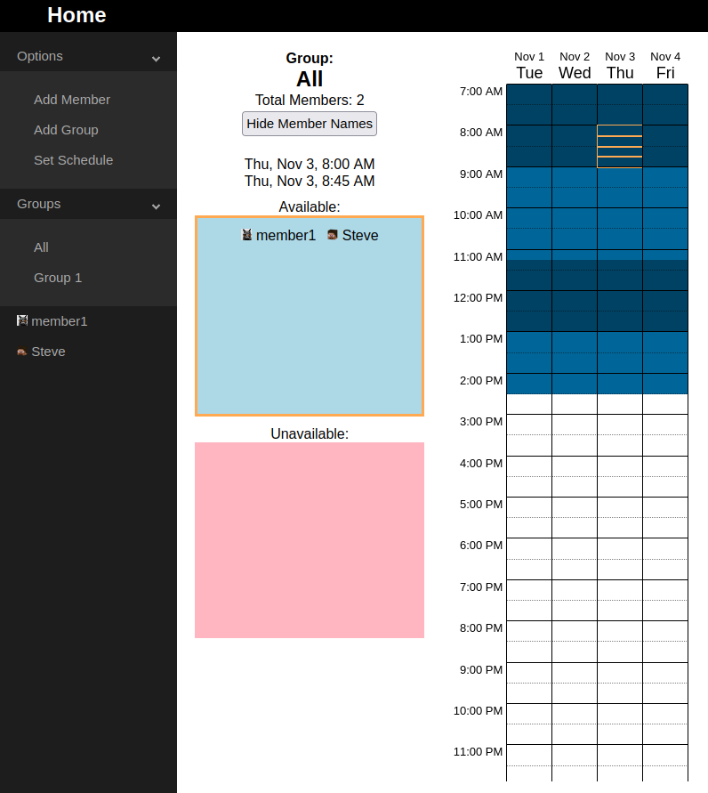

# Scheduler Frontend

## React+Node.js schedule website designed to make meetings easy.

### [Click here to view a demo room!](https://schedge.netlify.app/6365876e236451f56f754237)

## Features:
* Auto-correct for timezone differences
* Signup to create and manage meeting rooms
* Hover mouse over timeslot to view available members and date+time
* Brightness of timeslot affected by number of available members
* Add members and edit their availability
* Create and manage member groups
* Set the schedule with a range of dates

